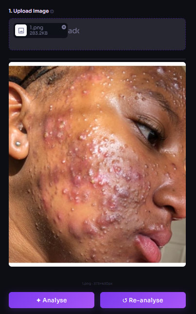
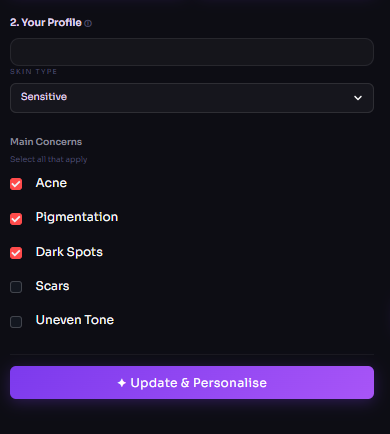
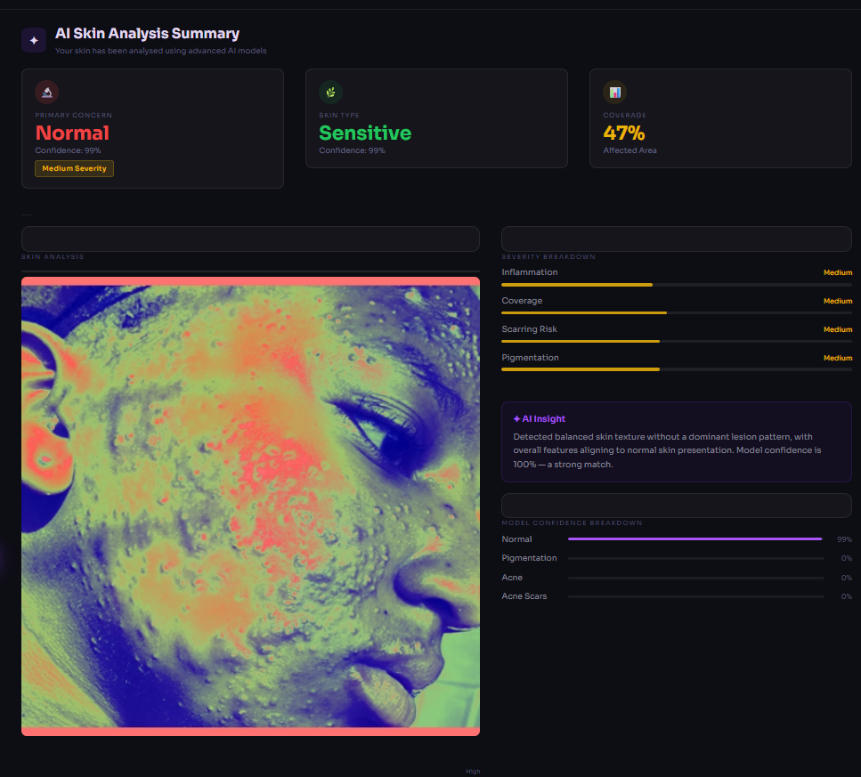

# SkinAura AI

<p align="center">
  Real-time skin condition analysis, confidence-aware predictions, and personalized skincare recommendations.
</p>

<p align="center">
  
  
  
  
</p>

<p align="center">
  <a href="https://skinaura-ai.streamlit.app/">
    
  </a>

  <a href="https://skinaura-backend.onrender.com">
    
  </a>
</p>

---

# Modular Computer Vision System for Dermatological Analysis & Personalized Skincare Recommendations

SkinAura AI is an end-to-end AI-powered skincare analysis system that combines computer vision, deep learning, and real-time inference to analyze facial skin conditions and generate personalized skincare recommendations.

The project focuses on building a practical and interpretable AI pipeline rather than limiting the workflow to simple image classification outputs.

---

# Live Deployment

| Service | Link |
|---|---|
| Frontend | https://skinaura-ai.streamlit.app/ |
| Backend API | https://skinaura-backend.onrender.com |
| GitHub Repository | https://github.com/sujanya-hub/SkinAura-Modular-Computer-Vision-System-for-Dermatological-Analysis-Recommendation |

---

# Overview

SkinAura AI combines:

- Image preprocessing
- CNN-based skin condition classification
- Confidence-aware predictions
- Severity estimation
- Personalized skincare recommendations
- Real-time inference
- Modular frontend/backend deployment

The system transforms raw image predictions into structured skincare guidance with explainable outputs and interpretable recommendation generation.

---

# Preview

## Upload & Image Analysis Interface

Image upload workflow with preprocessing and real-time inference.



---

## Skin Profile Configuration

User profile selection and contextual skincare recommendation setup.



---

## AI Analysis Dashboard

Confidence-aware predictions, severity interpretation, and preprocessing visualization.



---

## Recommendation Engine

Structured skincare routines, ingredient suggestions, and severity-aware recommendations.


---

# Problem Statement

Most dermatology-related machine learning projects stop at classification outputs.

SkinAura AI extends this workflow by:

- Generating confidence-aware predictions
- Mapping predictions to severity levels
- Creating structured skincare routines
- Recommending skincare ingredients
- Separating inference from recommendation logic
- Deploying a production-style frontend/backend pipeline

This transforms the project from a simple ML demo into a modular AI-assisted skincare recommendation system.

---

# System Architecture

```text
          ┌─────────────────────────┐
          │ Streamlit Frontend UI  │
          └──────────┬─────────────┘
                     │
                     ▼
          ┌─────────────────────────┐
          │     FastAPI Backend     │
          │   Inference Endpoints   │
          └──────────┬─────────────┘
                     │
                     ▼
          ┌─────────────────────────┐
          │ CNN Classification Model│
          └──────────┬─────────────┘
                     │
                     ▼
          ┌─────────────────────────┐
          │ Recommendation Engine   │
          │ + Severity Mapping      │
          └─────────────────────────┘
```

---

# Core Components

## Frontend — Streamlit Dashboard

Handles:

- Image uploads
- Prediction visualization
- Confidence rendering
- Recommendation display
- User interaction workflows

---

## Backend — FastAPI

Responsible for:

- Request validation
- Image preprocessing
- Model inference
- API orchestration
- Response formatting

---

## Model Layer

CNN-based image classification model built using TensorFlow/Keras for dermatological condition prediction.

---

## Recommendation Engine

Rule-based recommendation pipeline that converts predictions into:

- Personalized skincare guidance
- Severity estimation
- Ingredient recommendations
- AM/PM skincare routines

---

# Detection Categories

The model supports detection of:

- Acne
- Acne Scars
- Pigmentation
- Texture Irregularities
- Normal Skin

---

# Image Processing Pipeline

To improve inference consistency across varying image conditions, the system includes OpenCV-based preprocessing techniques.

## Techniques Used

- CLAHE (Contrast Limited Adaptive Histogram Equalization)
- Adaptive lighting normalization
- Image resizing and normalization
- Tensor preprocessing

These preprocessing stages improve texture visibility and reduce lighting-related prediction instability.

---

# Interpretable Prediction Design

Instead of returning only a single label, the system exposes:

- Primary prediction
- Confidence score
- Secondary prediction probabilities
- Confidence distribution
- Severity mapping

This improves prediction interpretability and enhances output transparency.

---

# Engineering Decisions

| Decision | Reasoning |
|---|---|
| CNN-based architecture | Lightweight and efficient for real-time inference |
| OpenCV preprocessing | Improves robustness under varying lighting conditions |
| Frontend/backend separation | Enables modular deployment and scalability |
| Confidence-aware outputs | Improves interpretability |
| Rule-based recommendation engine | Keeps recommendation generation explainable |
| FastAPI inference endpoints | Simplifies deployment and API orchestration |

---

# Technical Stack

| Layer | Technologies |
|---|---|
| Machine Learning | TensorFlow, Keras |
| Computer Vision | OpenCV, PIL |
| Backend | FastAPI, Uvicorn, Pydantic |
| Frontend | Streamlit |
| Data Processing | NumPy, Pandas |
| Deployment | Render, Streamlit Cloud |
| Version Control | Git, GitHub |

---

# Model Specifications

| Component | Details |
|---|---|
| Base Architecture | CNN |
| Framework | TensorFlow/Keras |
| Input Resolution | 224 × 224 × 3 |
| Output Layer | Softmax Classification |
| Inference Type | Multi-Class Classification |

---

# Model Performance & System Design

- Trained a CNN-based multi-class skin condition classification model on a curated dataset of 3,500+ dermatological images.

- Achieved 95–96% validation accuracy across supported skin-condition categories using TensorFlow/Keras-based training workflows.

- Implemented real-time inference pipelines with OpenCV preprocessing, CLAHE-based lighting normalization, and confidence-aware prediction outputs.

- Designed a modular FastAPI + Streamlit deployment architecture separating preprocessing, inference, and recommendation workflows.

---

# Project Structure

```text
SkinAura/
│
├── assets/
│   ├── analysis-dashboard.png
│   ├── profile-selection.png
│   ├── recommendations.png
│   └── upload-interface.png
│
├── backend/
├── frontend/
├── models/
├── utils/
├── uploads/
│
├── app_dashboard.py
├── requirements.txt
└── README.md
```

---

# Running the Project

## Clone the Repository

```bash
git clone https://github.com/sujanya-hub/SkinAura-Modular-Computer-Vision-System-for-Dermatological-Analysis-Recommendation.git
```

---

## Install Dependencies

```bash
pip install -r requirements.txt
```

---

## Run Backend

```bash
uvicorn backend.main:app --reload
```

---

## Run Frontend

```bash
streamlit run app_dashboard.py
```

---

# Current Limitations

- Dataset diversity can still be improved
- No clinical or dermatological validation
- Recommendation engine is currently rule-based
- Performance depends heavily on image quality and lighting
- System is not optimized for blurry or extremely low-light images

---

# Planned Improvements

- Vision Transformer (ViT) integration
- U-Net segmentation for localized analysis
- Real-time webcam inference
- Mobile application support
- Learned recommendation systems
- Improved dataset diversity
- Lower-latency inference optimization

---

# Example Use Cases

## Personalized Skincare Assistance

Generate skincare recommendations based on detected skin conditions.

---

## Educational Computer Vision Demonstration

Demonstrates modular image classification and deployment pipelines.

---

## AI-Powered Skin Analysis

Provides confidence-aware dermatological condition predictions.

---

## ML Deployment Demonstration

Showcases frontend/backend deployment of AI systems using FastAPI and Streamlit.

---

# Disclaimer

This project is intended for educational and research purposes only.

It is not a medical diagnostic system and should not replace professional dermatological advice.

---

# Developer

## Sujanya Srinivas

AI/ML Engineer focused on:

- Computer Vision Systems
- AI Deployment Pipelines
- Real-Time Inference Systems
- Applied Deep Learning
- Full-Stack AI Applications

---

# License

MIT License
