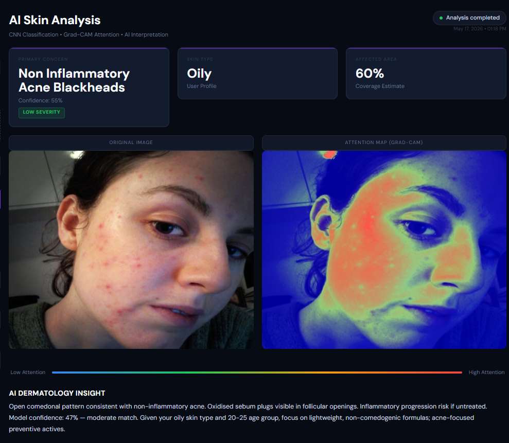
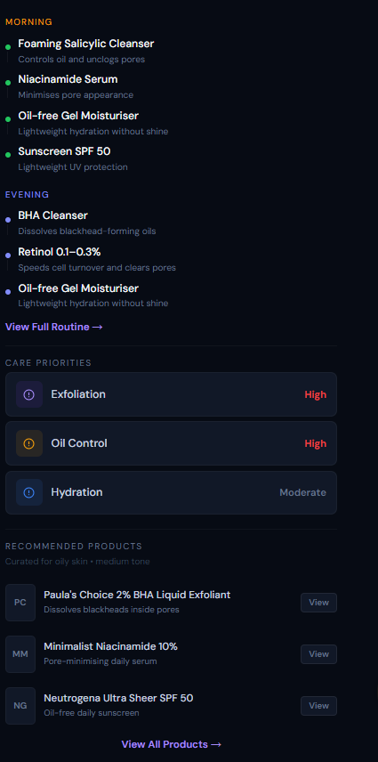
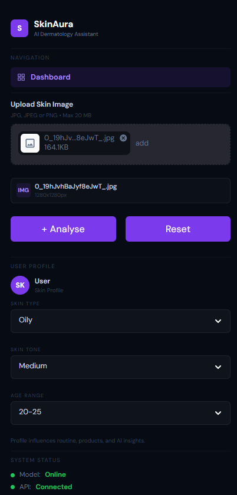
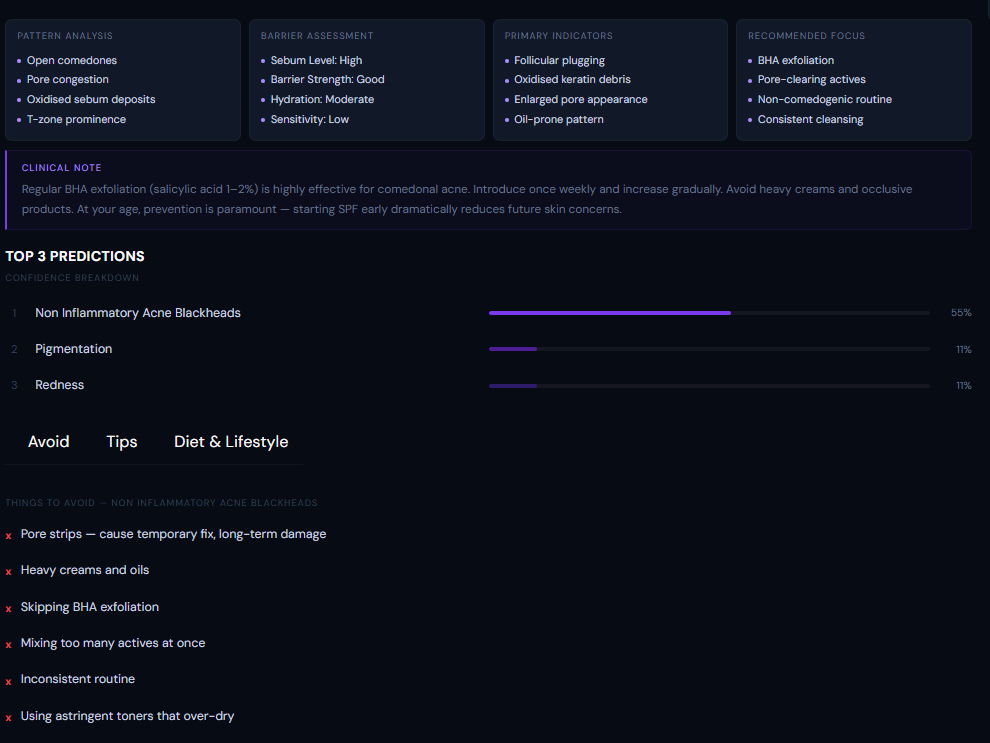

<div align="center">


<br /><br />

```
███████╗██╗  ██╗██╗███╗   ██╗ █████╗ ██╗   ██╗██████╗  █████╗ 
██╔════╝██║ ██╔╝██║████╗  ██║██╔══██╗██║   ██║██╔══██╗██╔══██╗
███████╗█████╔╝ ██║██╔██╗ ██║███████║██║   ██║██████╔╝███████║
╚════██║██╔═██╗ ██║██║╚██╗██║██╔══██║██║   ██║██╔══██╗██╔══██║
███████║██║  ██╗██║██║ ╚████║██║  ██║╚██████╔╝██║  ██║██║  ██║
╚══════╝╚═╝  ╚═╝╚═╝╚═╝  ╚═══╝╚═╝  ╚═╝ ╚═════╝ ╚═╝  ╚═╝╚═╝  ╚═╝
```

### **Modular Computer Vision System for Dermatological Analysis & Recommendation**
*EfficientNetB0 · Focal Loss · FastAPI · TensorFlow — Production confidence up to 90.25%*

<br />

[](https://skinaura-frontend.onrender.com)
[](https://skinaura-backend.onrender.com)

</div>

---

## What Is SkinAura?

SkinAura is a **production-deployed dermatological AI classifier** that accepts skin images and returns confidence-scored predictions with severity estimation — targeting early screening support in low-resource healthcare settings.

Built with EfficientNetB0 and a 3-phase staged fine-tuning strategy, SkinAura achieves production confidence scores up to **90.25%** with warm inference latency of **181–320 ms** via FastAPI.

---

## Screenshots

### AI Skin Analysis Dashboard



---

### Personalized Recommendations



---

### Upload & User Profile Interface



---

### AI Pipeline & Grad-CAM Analysis



---

## Performance Benchmarks

| Metric | Value |
|--------|-------|
| Peak Production Confidence | **90.25%** |
| Warm Inference Latency | **181–320 ms** |
| Cold-Start (Render Free Tier) | ~7 s |
| Preprocessing Overhead | **~38 ms** per image |
| Production Inference Events | **17+** logged |

---

## System Architecture

```
┌─────────────────────────────────────────────────────────────────┐
│                        FRONTEND                                 │
│              Streamlit UI — Render Deployment                   │
└──────────────────────────┬──────────────────────────────────────┘
                           │  HTTP POST (image)
                           ▼
┌─────────────────────────────────────────────────────────────────┐
│                   PREPROCESSING LAYER                           │
│    CLAHE → Adaptive Normalization → Resize (224×224)           │
│                   avg overhead: 38ms                            │
└──────────────────────────┬──────────────────────────────────────┘
                           │
                           ▼
┌─────────────────────────────────────────────────────────────────┐
│                    INFERENCE LAYER                               │
│    EfficientNetB0 (TensorFlow/Keras)                           │
│    Focal Loss γ=2.0 · Mixed-Precision · 3-Phase Fine-Tuning    │
│    Cosine-Decay LR Scheduling                                   │
└──────────────────────────┬──────────────────────────────────────┘
                           │
                           ▼
┌─────────────────────────────────────────────────────────────────┐
│                 RECOMMENDATION LAYER                            │
│    Confidence-Aware Output → Severity Estimation               │
│    Rule-Based Recommendation Engine                             │
└─────────────────────────────────────────────────────────────────┘
```

---

## Tech Stack

| Layer | Technology |
|-------|-----------|
| **Model Architecture** | EfficientNetB0 |
| **Loss Function** | Focal Loss (γ=2.0) |
| **Training Strategy** | 3-Phase Staged Fine-Tuning |
| **LR Scheduling** | Cosine Decay |
| **Precision** | Mixed-Precision (float16/32) |
| **Preprocessing** | CLAHE, Adaptive Normalization, OpenCV |
| **Framework** | TensorFlow / Keras |
| **Backend API** | FastAPI |
| **Frontend** | Streamlit |
| **Deployment** | Render (Frontend + Backend) |

---

## Core Features

- **EfficientNetB0 backbone** — compound scaling for accuracy/efficiency balance
- **Focal Loss (γ=2.0)** — handles class imbalance in dermatological datasets
- **3-Phase staged fine-tuning** — progressive unfreezing for stable convergence
- **CLAHE preprocessing** — contrast-limited adaptive histogram equalization for lighting robustness
- **Confidence-aware outputs** — every prediction includes a calibrated confidence score
- **Severity estimation** — structured severity levels with actionable recommendations
- **Modular architecture** — preprocessing → inference → recommendation as independent layers
- **FastAPI backend** — clean REST endpoint, easy to extend with LLM-based guidance

---

## Model Training Details

```python
# Architecture
base_model = EfficientNetB0(weights='imagenet', include_top=False)

# Loss
loss = FocalLoss(gamma=2.0, alpha=0.25)

# Training Strategy
Phase 1: Frozen base, train classification head
Phase 2: Unfreeze top N layers, fine-tune with low LR
Phase 3: Full model fine-tune with cosine-decay schedule

# Precision
tf.keras.mixed_precision.set_global_policy('mixed_float16')
```

---

## Run Locally

```bash
git clone https://github.com/sujanya-hub/SkinAura-Modular-Computer-Vision-System-for-Dermatological-Analysis-Recommendation
cd SkinAura-Modular-Computer-Vision-System-for-Dermatological-Analysis-Recommendation

# Install dependencies
pip install -r requirements.txt

# Start backend
uvicorn backend.main:app --reload

# Start frontend (separate terminal)
streamlit run frontend/app.py
```

---

## Project Structure

```
SkinAura/
├── assets/
├── backend/
├── frontend/
├── src/
├── .gitattributes
├── .gitignore
├── cleanup_dataset.py
├── metrics_logger.py
├── requirements.txt
├── scripts
├── train_model.py
└── README.md
```

---

## Live Deployments

| Service | URL |
|---------|-----|
| **Frontend** | [skinaura-frontend.onrender.com](https://skinaura-frontend.onrender.com) |
| **Backend API** | [skinaura-backend.onrender.com](https://skinaura-backend.onrender.com) |

> *Cold-start on Render free-tier ~7s on first request. Noted in app UI. Warm requests: 181–320ms.*

---

<div align="center">

**Built by [Sujanya Srinivas](https://linkedin.com/in/sujanya-s-538a7a2b1)**
[LinkedIn](https://linkedin.com/in/sujanya-s-538a7a2b1) · [GitHub](https://github.com/sujanya-hub) · [Email](mailto:sujanyasrinivasa@gmail.com)

</div>
